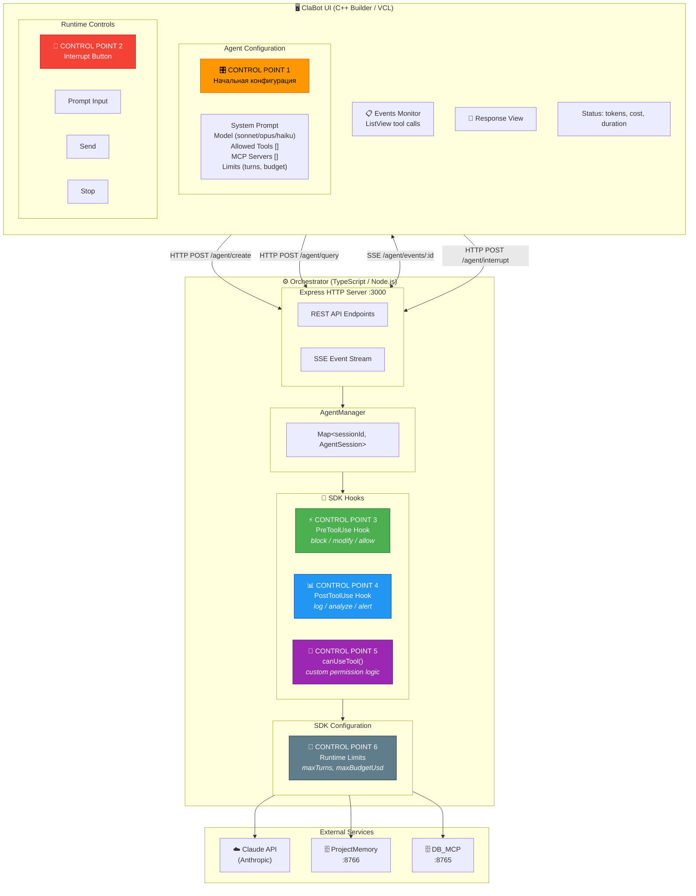
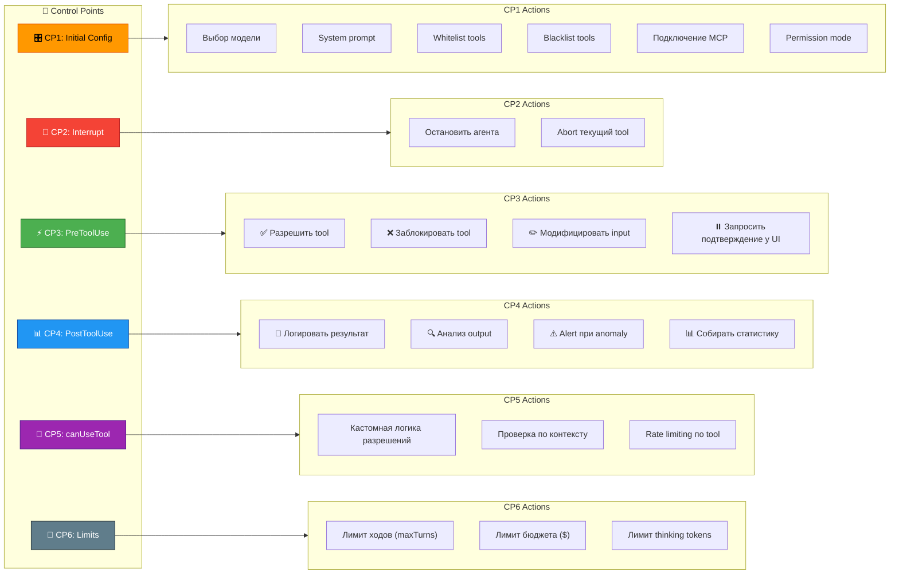
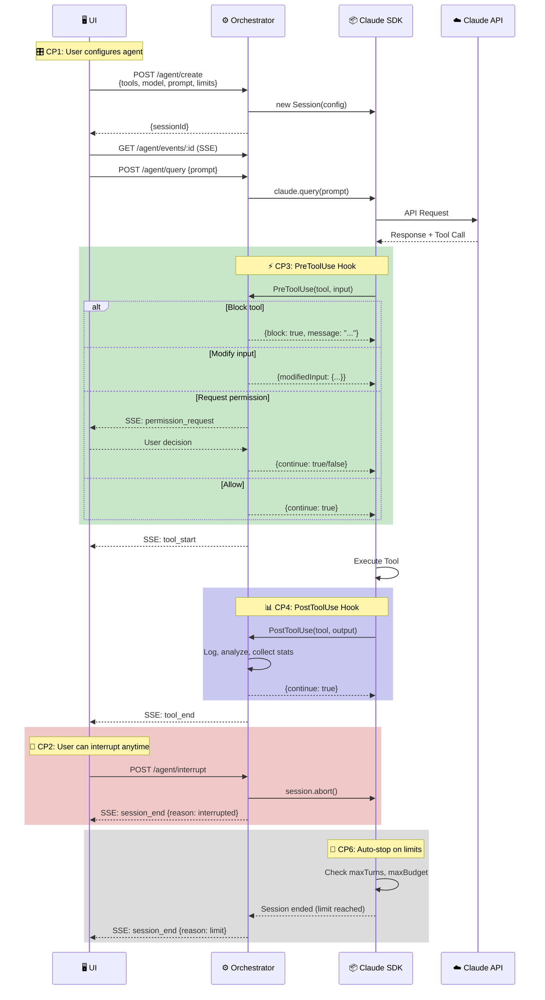
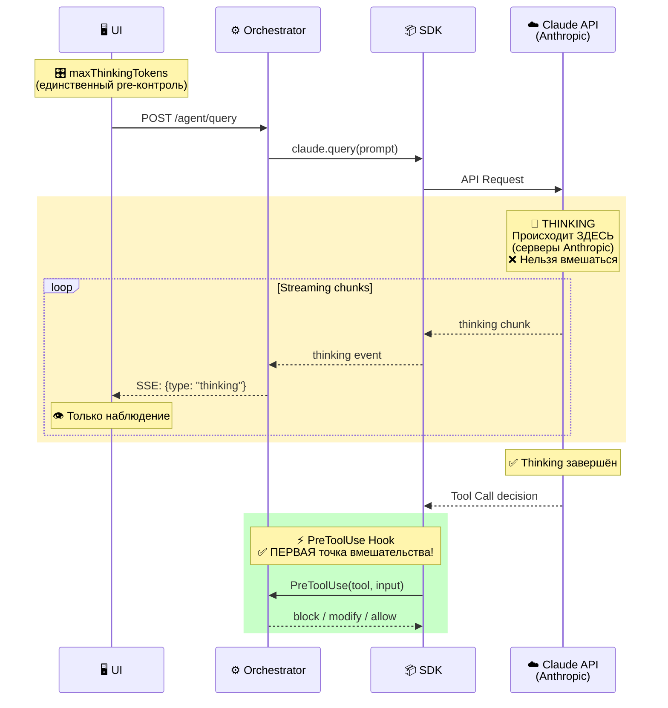
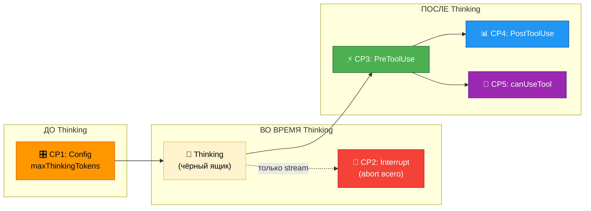

# ClaBot — Архитектура системы

## Общая схема с точками контроля

---

## Точки контроля (детально)

---

## Поток выполнения с точками контроля

---

## Thinking Process (Extended Thinking)

**Thinking происходит на серверах Anthropic — это "чёрный ящик".**

### Контроль над Thinking

| Момент | ✅ Можно | ❌ Нельзя |
|--------|----------|-----------|
| **До запроса** | `maxThinkingTokens` — ограничить объём | Задать направление мыслей |
| **Во время** | Получать stream, отображать в UI | Модифицировать, направлять, фильтровать |
| **Прервать** | Abort всего запроса (interrupt) | Откатить только thinking |

### Где находятся точки контроля относительно Thinking

**Вывод:** Реальный контроль над действиями агента начинается **после thinking**, когда агент принял решение вызвать tool.

---

## Таблица точек контроля

| # | Точка | Где | Когда | Возможные действия |
|---|-------|-----|-------|-------------------|
| 🎛️ CP1 | Initial Config | UI | До создания агента | Выбор tools, model, prompt, limits, MCP |
| 🛑 CP2 | Interrupt | UI | В любой момент | Остановить агента |
| ⚡ CP3 | PreToolUse | Orchestrator | Перед каждым tool | Block, Modify, Allow, Request Permission |
| 📊 CP4 | PostToolUse | Orchestrator | После каждого tool | Log, Analyze, Alert |
| 🔐 CP5 | canUseTool | Orchestrator | При проверке tool | Custom permission logic |
| 📏 CP6 | Limits | SDK | Автоматически | Auto-stop при превышении |

---

## Компоненты

### Orchestrator (TypeScript)

| Файл | Назначение |
|------|------------|
| `src/index.ts` | Entry point, инициализация и запуск сервера |
| `src/server.ts` | Express routes, SSE endpoints, middleware |
| `src/agent-manager.ts` | Класс AgentManager — управление сессиями агентов |
| `src/types.ts` | TypeScript интерфейсы (AgentConfig, AgentEvent, etc.) |
| `src/presets.ts` | Предустановленные профили агентов |

### UI (C++ Builder)

| Файл | Назначение |
|------|------------|
| `uMain.cpp/h/dfm` | Главная форма TfrmMain с UI компонентами |
| `uOrchestratorClient.cpp/h` | Класс TOrchestratorClient — HTTP/SSE клиент |
| `uAgentConfig.cpp/h` | Класс TAgentConfig — конфигурация агента |
| `uEventParser.cpp/h` | Парсинг JSON событий из SSE stream |

---

## Типы событий SSE

| Тип | Описание | Данные |
|-----|----------|--------|
| `session_start` | Сессия агента создана | `sessionId`, `config` |
| `tool_start` | Начало выполнения tool | `tool`, `input`, `toolUseId` |
| `tool_end` | Tool завершён успешно | `tool`, `output`, `toolUseId` |
| `tool_error` | Ошибка tool | `tool`, `error`, `toolUseId` |
| `assistant_message` | Текстовый ответ агента | `content`, `uuid` |
| `thinking` | Размышления агента (stream) | `content` |
| `permission_request` | Запрос разрешения | `tool`, `input` |
| `session_end` | Сессия завершена | `reason`, `usage` |
| `error` | Ошибка системы | `message` |

---

## Технический стек

| Компонент | Технологии |
|-----------|------------|
| **Orchestrator** | Node.js 18+, TypeScript, Express, Claude Agent SDK |
| **UI** | RAD Studio 12+, C++ Builder, VCL, Indy (HTTP/SSE) |
| **Протоколы** | HTTP REST, Server-Sent Events (SSE), JSON |
| **MCP** | HTTP transport на localhost |
