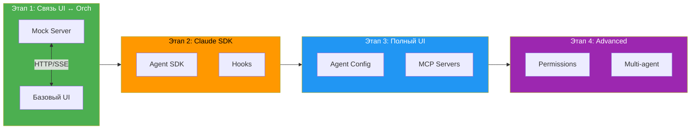
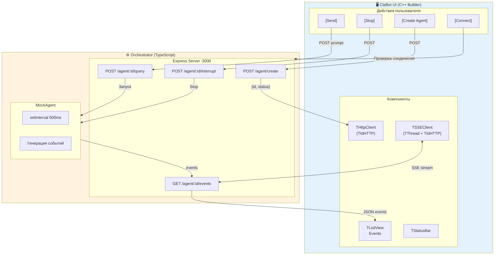
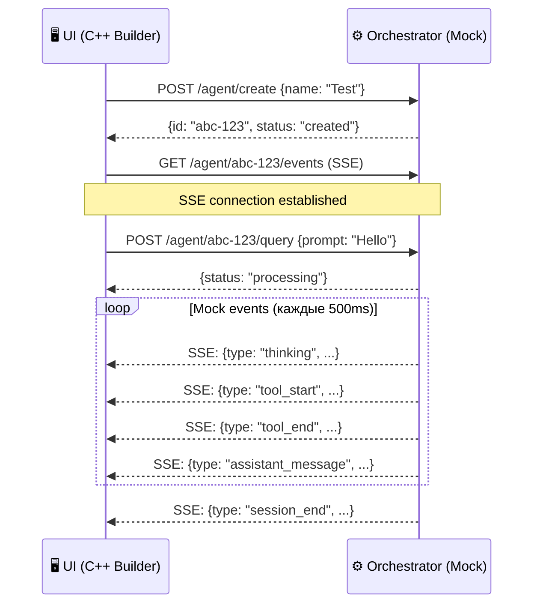

# ClaBot — План реализации

## Общая схема этапов



---

## Этап 1: Схема взаимодействия UI ↔ Orchestrator

**Цель:** Отладить HTTP/SSE коммуникацию между C++ Builder UI и TypeScript сервером. Без Claude SDK — только mock данные.

### Схема взаимодействия (Этап 1)



### 1.1 Orchestrator (TypeScript) — Mock Server

```
orchestrator/
├── package.json
├── tsconfig.json
└── src/
    ├── index.ts          # Entry point
    ├── server.ts         # Express + SSE
    ├── types.ts          # Интерфейсы
    └── mock-agent.ts     # Mock агент (имитация)
```

**API endpoints (mock):**

| Endpoint | Метод | Описание | Mock Response |
|----------|-------|----------|---------------|
| `/agent/create` | POST | Создать агента | `{id: "uuid", status: "created"}` |
| `/agent/:id/query` | POST | Отправить промпт | `{status: "processing"}` |
| `/agent/:id/events` | GET | SSE stream | Mock события каждые 500ms |
| `/agent/:id/status` | GET | Статус агента | `{status: "idle/running"}` |
| `/agent/:id/interrupt` | POST | Прервать | `{status: "interrupted"}` |
| `/agent/:id` | DELETE | Удалить сессию | `{status: "deleted"}` |

**Mock SSE события:**
```
→ {type: "session_start", sessionId: "..."}
→ {type: "thinking", content: "Анализирую запрос..."}
→ {type: "tool_start", tool: "Glob", input: {pattern: "**/*.ts"}}
→ {type: "tool_end", tool: "Glob", output: {files: ["a.ts", "b.ts"]}}
→ {type: "assistant_message", content: "Найдено 2 файла..."}
→ {type: "session_end", usage: {tokens: 150, cost: 0.001}}
```

### 1.2 UI (C++ Builder) — HTTP/SSE Client

```
ui/
├── ClaBot.cbproj
├── ClaBot.cpp            # WinMain
├── uMain.h/cpp/dfm       # Главная форма
├── uHttpClient.h/cpp     # HTTP клиент (TIdHTTP)
└── uSSEClient.h/cpp      # SSE клиент (TThread + TIdHTTP)
```

**Главная форма — минимальный набор:**

```
┌─────────────────────────────────────────────────────────────┐
│ ClaBot - Test Connection                             [─][□][×]│
├─────────────────────────────────────────────────────────────┤
│                                                             │
│  Server: [http://localhost:3000    ] [Connect]              │
│                                                             │
│  ┌─ Agent ─────────────────────────────────────────────┐    │
│  │ Name: [Test Agent        ]  [Create Agent]          │    │
│  └─────────────────────────────────────────────────────┘    │
│                                                             │
│  ┌─ Events ────────────────────────────────────────────┐    │
│  │ Time     │ Type    │ Data                           │    │
│  │──────────│─────────│────────────────────────────────│    │
│  │ 12:00:01 │ start   │ session_start                  │    │
│  │ 12:00:02 │ think   │ Анализирую запрос...           │    │
│  │ 12:00:03 │ tool    │ Glob: **/*.ts                  │    │
│  │ 12:00:04 │ tool    │ → 2 files                      │    │
│  │ 12:00:05 │ message │ Найдено 2 файла...             │    │
│  └─────────────────────────────────────────────────────┘    │
│                                                             │
│  Prompt: [                              ] [Send] [Stop]     │
│                                                             │
├─────────────────────────────────────────────────────────────┤
│ Status: Connected │ Agent: abc-123 │ Events: 5             │
└─────────────────────────────────────────────────────────────┘
```

### 1.3 Sequence диаграмма (Этап 1)



### 1.4 Checklist Этапа 1

**Orchestrator:**
- [ ] Инициализация TypeScript проекта
- [ ] Express сервер на порту 3000
- [ ] CORS для localhost
- [ ] POST /agent/create (возвращает UUID)
- [ ] GET /agent/:id/events (SSE stream)
- [ ] POST /agent/:id/query (запуск mock событий)
- [ ] Mock агент генерирует события с задержкой
- [ ] POST /agent/:id/interrupt (остановка mock)

**UI:**
- [ ] Создание VCL проекта
- [ ] TIdHTTP для REST запросов
- [ ] TThread + TIdHTTP для SSE
- [ ] Парсинг JSON событий (System.JSON)
- [ ] TListView для отображения событий
- [ ] Кнопки: Connect, Create Agent, Send, Stop
- [ ] StatusBar с состоянием

**Результат этапа:**
UI может создать агента, отправить промпт и видеть поток mock-событий в реальном времени.

---

## Этап 2: Интеграция Claude Agent SDK

**Цель:** Заменить mock на реальный Claude Agent SDK.

### 2.1 Изменения в Orchestrator

```diff
  orchestrator/src/
  ├── index.ts
  ├── server.ts
  ├── types.ts
- ├── mock-agent.ts
+ ├── agent-manager.ts    # Реальное управление агентами
+ └── claude-session.ts   # Интеграция с SDK
```

**Добавить:**
- Claude Agent SDK интеграция
- Hooks: PreToolUse, PostToolUse
- Реальные события от SDK → SSE
- Обработка ошибок API

### 2.2 Checklist Этапа 2

- [ ] Установка @anthropic-ai/claude-agent-sdk
- [ ] AgentManager класс
- [ ] ClaudeSession класс с hooks
- [ ] PreToolUse → SSE tool_start
- [ ] PostToolUse → SSE tool_end
- [ ] Streaming thinking → SSE thinking
- [ ] Обработка API ошибок

---

## Этап 3: Полная конфигурация агента в UI

**Цель:** UI позволяет настраивать все параметры агента.

### 3.1 Расширение UI

```
┌─ Agent Configuration ───────────────────────┐
│ Name: [                    ]                │
│                                             │
│ System Prompt:                              │
│ ┌─────────────────────────────────────────┐ │
│ │                                         │ │
│ └─────────────────────────────────────────┘ │
│                                             │
│ Model: [Sonnet ▼]                           │
│                                             │
│ Tools:                    MCP Servers:      │
│ [x] Read                  [x] ProjectMemory │
│ [x] Glob                  [ ] DB_MCP        │
│ [x] Grep                                    │
│ [ ] Edit                                    │
│ [ ] Write                                   │
│ [ ] Bash                                    │
│                                             │
│ Limits:                                     │
│ Max Turns: [10    ]  Budget: [$0.50  ]      │
│                                             │
│ Permission Mode: [Default ▼]                │
│                                             │
│ Working Dir: [C:\Projects\MyApp        ][…] │
└─────────────────────────────────────────────┘
```

### 3.2 Checklist Этапа 3

- [ ] TMemo для System Prompt
- [ ] TComboBox для Model
- [ ] TCheckListBox для Tools
- [ ] TCheckListBox для MCP Servers
- [ ] TEdit для лимитов
- [ ] TComboBox для Permission Mode
- [ ] Выбор Working Directory
- [ ] Сохранение/загрузка конфигураций (JSON)

---

## Этап 4: Продвинутые возможности

- [ ] Permission Request → диалог в UI
- [ ] Предустановленные профили агентов
- [ ] История сессий
- [ ] Экспорт логов
- [ ] Множественные агенты одновременно

---

## Приоритет файлов (Этап 1)

| # | Файл | Описание |
|---|------|----------|
| 1 | `orchestrator/package.json` | Зависимости |
| 2 | `orchestrator/tsconfig.json` | TypeScript config |
| 3 | `orchestrator/src/types.ts` | Интерфейсы |
| 4 | `orchestrator/src/server.ts` | Express + SSE |
| 5 | `orchestrator/src/mock-agent.ts` | Mock генератор событий |
| 6 | `orchestrator/src/index.ts` | Entry point |
| 7 | `ui/ClaBot.cbproj` | C++ Builder проект |
| 8 | `ui/uMain.*` | Главная форма |
| 9 | `ui/uHttpClient.*` | HTTP клиент |
| 10 | `ui/uSSEClient.*` | SSE клиент |
