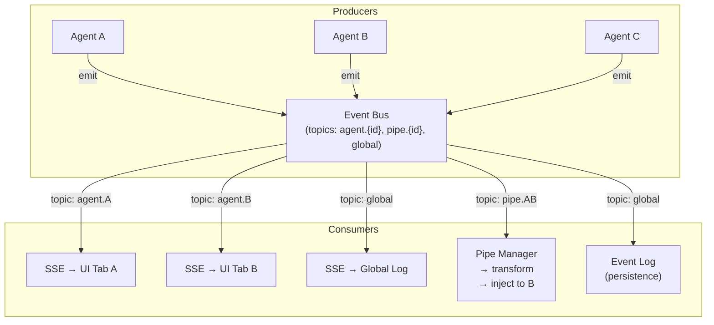

# Multi-Agent Architecture

Концептуальная архитектура ClaBot для запуска произвольного числа агентов
с маршрутизацией потоков данных между ними.

---

## 1. Общая схема

---

## 2. Pipe Manager — маршрутизация потоков

Ключевая новая абстракция: **Pipe** — направленный канал данных между агентами.

### Pipe Definition

---

## 3. Agent Lifecycle (расширенный)

---

## 4. Паттерны композиции агентов

### 4.1. Chain (цепочка)

### 4.2. Fan-out / Fan-in (параллельная обработка)

### 4.3. Supervisor (контроль качества)

### 4.4. Debate (состязательная проверка)

---

## 5. API (расширение текущего REST)

```mermaid
graph LR
    subgraph "Текущие endpoints"
        E1["POST /agent/create"]
        E2["POST /agent/:id/query"]
        E3["GET  /agent/:id/events"]
        E4["POST /agent/:id/interrupt"]
        E5["GET  /agent/:id/status"]
        E6["DELETE /agent/:id"]
    end

    subgraph "Новые endpoints"
        N1["POST /pipes<br/>создать pipe между агентами"]
        N2["DELETE /pipes/:id<br/>удалить pipe"]
        N3["GET /pipes<br/>список всех pipes"]
        N4["PATCH /pipes/:id<br/>enable/disable pipe"]
        N5["GET /events/global<br/>SSE: все события всех агентов"]
        N6["POST /pipelines<br/>создать pipeline из шаблона"]
        N7["GET /pipelines/:id/status<br/>статус pipeline"]
        N8["POST /agents/:id/inject<br/>вручную подать данные агенту"]
    end

    style N1 fill:#e8f5e9
    style N2 fill:#e8f5e9
    style N3 fill:#e8f5e9
    style N4 fill:#e8f5e9
    style N5 fill:#e1f5fe
    style N6 fill:#fff3e0
    style N7 fill:#fff3e0
    style N8 fill:#f3e5f5
```

---

## 6. Event Bus — центральная шина событий

---

## 7. UI — мультиагентный интерфейс

---

## 8. Модель данных

---

## 9. Сценарий: Code Review Pipeline

Пример конкретного pipeline из трёх агентов:

---

## 10. Этапы реализации

---

## Ключевые принципы

1. **Event Bus как ядро** — вся коммуникация через pub/sub, агенты не знают друг о друге напрямую
2. **Pipe = фильтр + трансформ** — гибкая маршрутизация: какие события пропускать, как преобразовать перед доставкой
3. **Агенты stateless** — состояние в Session Store, агент можно пересоздать и возобновить через SDK resume
4. **UI отделён от топологии** — UI подписывается на topics Event Bus, не управляет pipes напрямую
5. **Инкрементальная реализация** — каждая фаза самоценна: N агентов → pipes → паттерны → persistence
