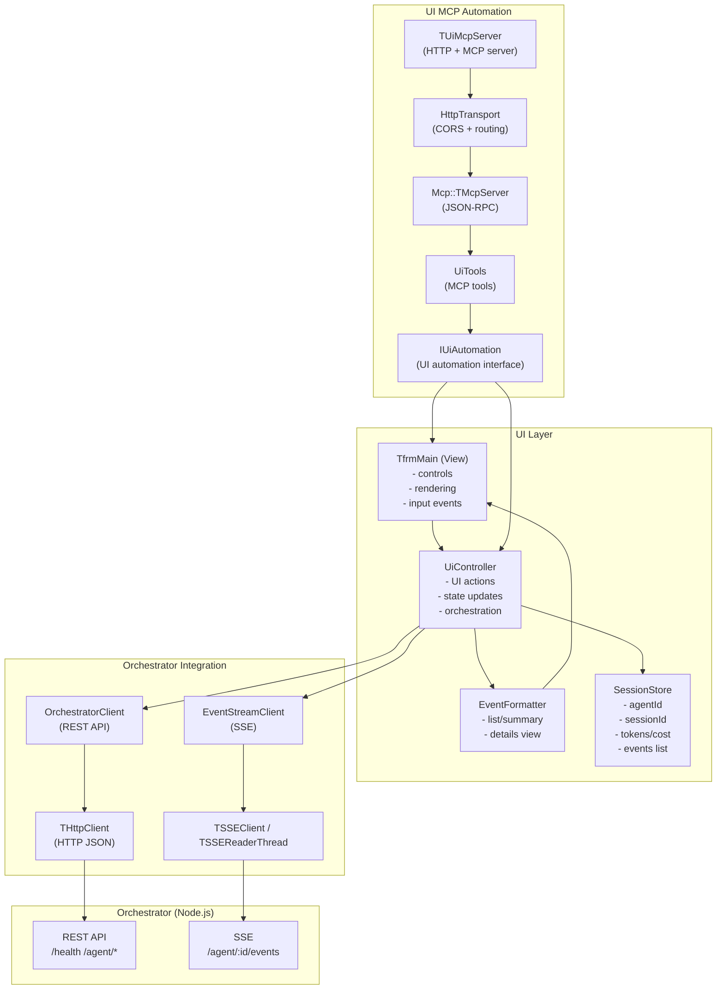

# UI Responsibility Diagram (Target Split)

```mermaid
flowchart TB
  %% UI Layer
  subgraph UI["UI Layer"]
    direction TB
    View["TfrmMain (View)\n- controls\n- rendering\n- input events"]
    Controller["UiController\n- UI actions\n- state updates\n- orchestration"]
    Formatter["EventFormatter\n- list/summary\n- details view"]
    Store["SessionStore\n- agentId\n- sessionId\n- tokens/cost\n- events list"]
  end

  %% Orchestrator Integration
  subgraph OrchestratorClientLayer["Orchestrator Integration"]
    direction LR
    OrchestratorClient["OrchestratorClient\n(REST API)"]
    HttpClient["THttpClient\n(HTTP JSON)"]
    EventStream["EventStreamClient\n(SSE)"]
    SseClient["TSSEClient / TSSEReaderThread"]
  end

  %% MCP UI Automation
  subgraph MCP["UI MCP Automation"]
    direction LR
    UiMcpServer["TUiMcpServer\n(HTTP + MCP server)"]
    HttpTransport["HttpTransport\n(CORS + routing)"]
    McpServer["Mcp::TMcpServer\n(JSON-RPC)"]
    UiTools["UiTools\n(MCP tools)"]
    UiAutomation["IUiAutomation\n(UI automation interface)"]
  end

  %% External Orchestrator
  subgraph Orchestrator["Orchestrator (Node.js)"]
    direction LR
    Api["REST API\n/health /agent/*"]
    Sse["SSE\n/agent/:id/events"]
  end

  %% UI responsibilities & flow
  View --> Controller
  Controller --> Store
  Controller --> Formatter
  Formatter --> View

  %% Orchestrator integration flow
  Controller --> OrchestratorClient
  OrchestratorClient --> HttpClient
  Controller --> EventStream
  EventStream --> SseClient
  HttpClient --> Api
  SseClient --> Sse

  %% MCP automation flow
  UiMcpServer --> HttpTransport --> McpServer --> UiTools --> UiAutomation
  UiAutomation --> Controller
  UiAutomation --> View
```
